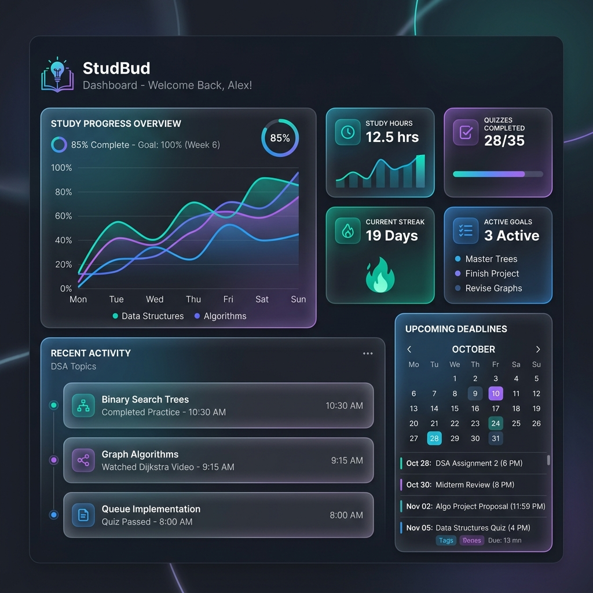
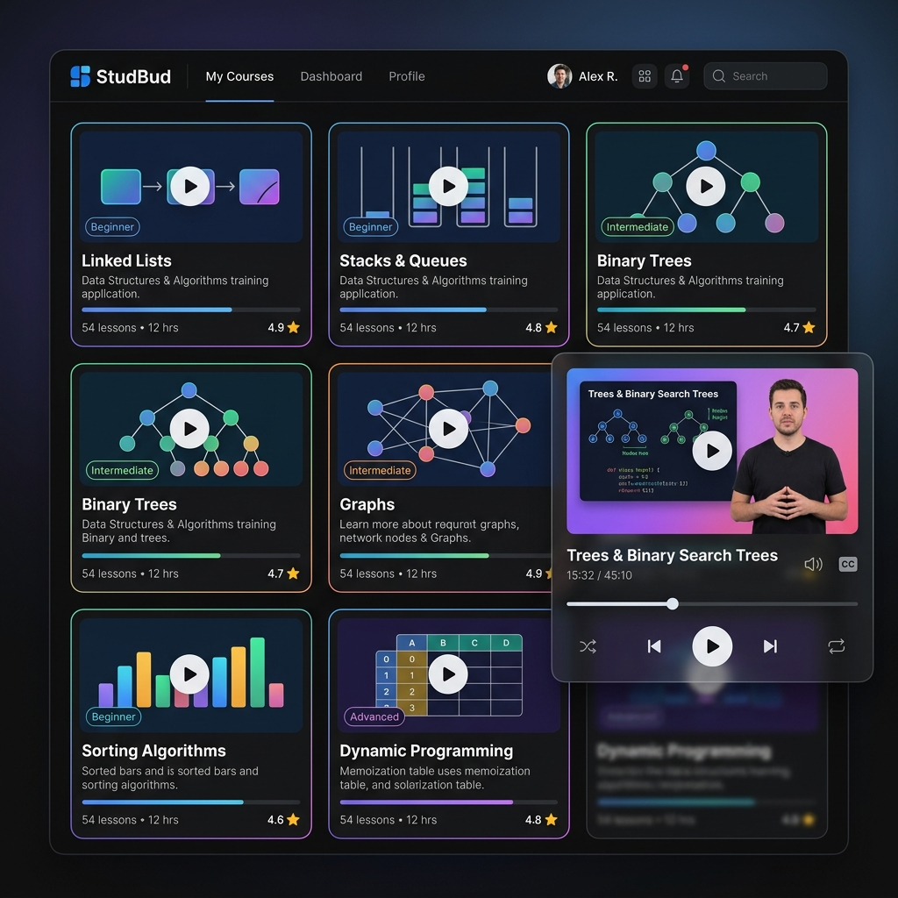

# 📚 StudBud (StudyHub) — The Ultimate DSA Study Buddy

[](https://studbud-gold.vercel.app)
[](https://react.dev)
[](https://vitejs.dev)
[](https://www.typescriptlang.org)
[](https://tailwindcss.com)

**StudBud** (also known as **StudyHub**) is a high-fidelity, premium Single Page Application (SPA) designed to help students master **Data Structures and Algorithms (DSA)**. It serves as a unified digital workstation featuring dashboard diagnostics, curated learning feeds, custom document readers, interactive mockups, and stateful Pomodoro focus sessions.

---

## 🔗 Live Site
Explore the live website immediately:  
🌐 **Production URL**: [https://studbud-gold.vercel.app](https://studbud-gold.vercel.app)

---

## 📸 Mockup Previews

### 📈 Dynamic Analytics Dashboard
*A glassmorphic dashboard showcasing live tracking metrics, study timelines, streaks, recent activity feeds, and syllabus checkpoints.*


### 🎥 Lecture Hub & Pop-up Video Player
*Curated video learning tracks from **Gate Smashers** featuring full overlays, autoplay embeds, and responsive thumbnail fallbacks.*


---

## ⚡ Core Features

### 1. 📊 Diagnostics Dashboard
* **Real-time Analytics**: Displays live study hours, streak calendars, completed quizzes, and read pages synced via a robust local-storage persistence engine.
* **Syllabus Deadlines**: Organized priority tracker to manage upcoming assignments, problem sets, and complexity analysis deadlines.
* **Weekly Goals**: Visual progress bar tracking weekly study goal thresholds.

### 2. 🎬 Verified Video Lecture Feeds
* **Gate Smashers Core Integration**: Loaded with 6 verified, highly-viewed DSA video lectures (ranging from single linked list structures, stack/queue concepts, BST insertion algorithms, to Dijkstra's Shortest Path theory).
* **Overlay Video Player Modal**: Clicking any card opens a dark, responsive cinematic overlay that embeds the YouTube player natively.
* **Self-Healing Fallbacks**: Uses resilient image links with a automated local fallback cache. If the YouTube image servers are blocked by academic or university firewalls, it immediately loads a premium high-res coding design as a fallback.

### 3. 📖 Custom Document Revision Reader
* **Rich Lecture Summaries**: Full revision sheets detailing operations, comparisons, memory addresses, and pseudo-code structures.
* **Built-in Markdown Reader**: Clicking "Read Now" opens an immersive scrollable document canvas complete with clean grid matrices, styled variables, and progress syncing.

### 4. ⏱️ Stateful Pomodoro Focus Timer
* Stateful timer system tracking active work vs. break periods, recording completed sessions directly to your diagnostics history.

### 5. ⌨️ Keyboard Shortcut Navigation (Power Hotkeys)
Navigate the entire platform instantly using single key taps (bypassed naturally when writing inside input or select boxes):
* `D` — Jump to **Dashboard**
* `N` — Jump to **Notes**
* `V` — Jump to **Videos**
* `Q` — Jump to **Quiz**
* `P` — Jump to **PYQ**
* `T` — Jump to **Timer**
* `Escape` — Instantly close any open active modal (Video player or Notes reader)

### 🔑 Instant Demo Sandbox (Pre-filled Credentials)
To provide frictionless evaluations, both Login and Signup forms are preloaded with test credentials:
* **Email**: `student69@somaiya.edu`
* **Password**: `password123`
* *Simply click "Sign In" or "Create Account" to land directly on the dashboard.*

---

## 🛠️ Technology Stack
* **Framework**: React 18 (Hooks, Stateful Context APIs)
* **Build tool**: Vite 5 (Bundler, hot-module reload)
* **Language**: TypeScript 5 (Strict types, clean modular interfaces)
* **Styling**: Tailwind CSS 3 (Dynamic layouts, glassmorphic filters, sleek dark overlays)
* **Icons**: Lucide React
* **Hosting**: Vercel CI/CD Production Pipeline

---

## 🚀 How to Run Locally

### Prerequisites
Make sure you have [Node.js](https://nodejs.org) installed on your system.

### Steps
1. **Clone and open the directory**:
   ```bash
   cd STUDBUD
   ```
2. **Install dependencies**:
   ```bash
   npm install
   ```
3. **Start the local Vite server**:
   ```bash
   npm run dev
   ```
4. **Access the local sandbox**:
   Open [http://localhost:5173](http://localhost:5173) in your web browser.

---

## 📝 License & Credits
* **Video Content**: Curated from the exceptional computer science playlists on the [Gate Smashers YouTube Channel](https://www.youtube.com/@GateSmashers) led by Varun Singla.
* **Design & Engineering**: Restructured, fixed, and polished to production quality.
