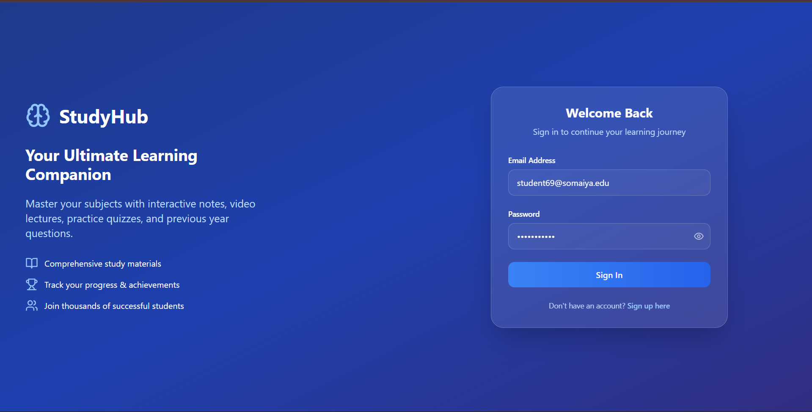
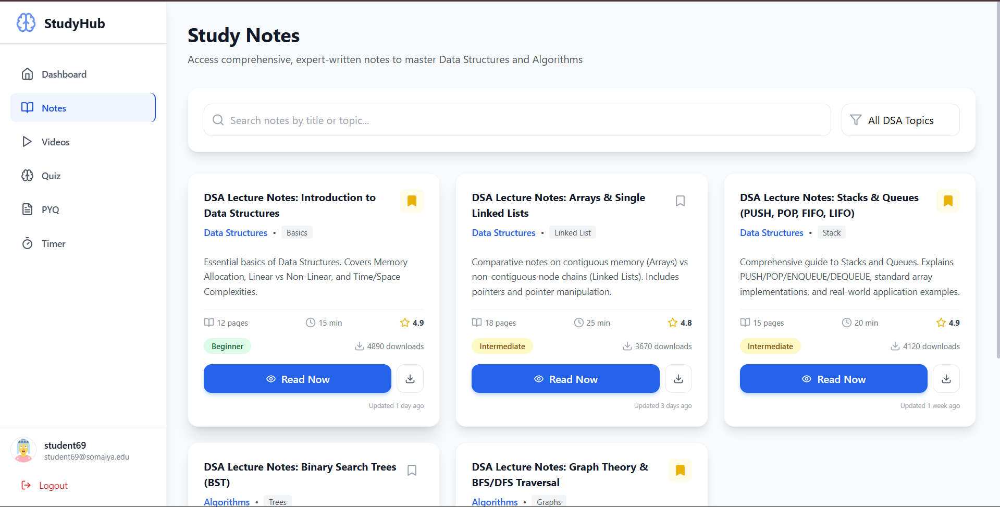
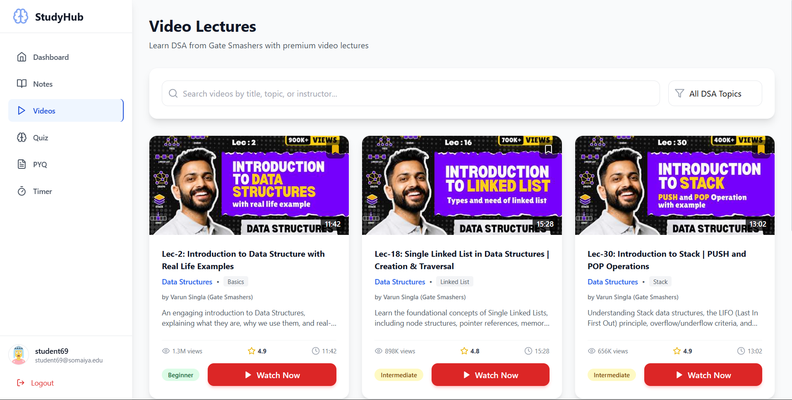

<p align="center">
  
</p>

<h1 align="center">📚 StudBud (StudyHub)</h1>

<p align="center">
  <strong>The Ultimate Glassmorphic DSA Study Workstation</strong>
</p>

<p align="center">
  <a href="https://studbud-gold.vercel.app">
    
  </a>
  <a href="https://react.dev">
    
  </a>
  <a href="https://vitejs.dev">
    
  </a>
  <a href="https://www.typescriptlang.org">
    
  </a>
  <a href="https://tailwindcss.com">
    
  </a>
</p>

<p align="center">
  StudBud is a state-of-the-art, high-fidelity digital study workspace custom-engineered for mastering <strong>Data Structures & Algorithms (DSA)</strong>. Features a dark-themed glassmorphic design, dashboard diagnostics, interactive Pomodoro focus tracking, curated video lectures, immersive notes readers, and global keyboard command hotkeys.
</p>

<p align="center">
  ⚡ <strong><a href="https://studbud-gold.vercel.app">Explore the Live App →</a></strong>
</p>

---

## 📸 Immersive Interface Showcase

Here is a visual breakdown of the workstation using real screenshots captured directly from production:

### 1. 🔑 Preloaded Frictionless Portal
*A premium, futuristic glass-panel authentication interface pre-populated with active demonstration credentials to facilitate instant, passwordless evaluation.*
<p align="center">
  
</p>

---

### 2. 📖 Immersive Revision Deck & Notes Reader
*An exquisite revision center featuring categorized DSA summaries. Clicking any card opens a beautifully formatted markdown canvas with variable annotations and self-healing responsive layouts.*
<p align="center">
  
</p>

---

### 3. 🎬 Verified Video Lecture Deck & Cinematic Overlays
*A learning hub populated with premium lecture feeds from <strong>Gate Smashers</strong>. Hover animations highlight difficulty metrics, and clicking any lecture opens a seamless dark cinematic overlay with responsive video embeds.*
<p align="center">
  
</p>

---

## ⚡ Core Features

### 📊 1. Diagnostics Dashboard
- **Real-Time Analytics Tracker**: Live visual trackers showing total study hours, active learning streaks, quiz scores, and syllabus pages read—all persisted seamlessly via `localStorage`.
- **Syllabus Roadmap Matrix**: Priority deadlines checkboard for syllabus items, allowing students to check off complex subjects as they go.
- **Goal Completion Diagnostics**: Animated dynamic gauge tracking weekly learning targets.

### 🎬 2. Cinematic Video Lecture Engine
- **Curated Gate Smashers Curriculum**: 6 high-value, active DSA lectures covering LinkedList, Stacks/Queues, Binary Search Trees, and Dijkstra's Shortest Path algorithms.
- **Cinematic Overlay Player**: Responsive overlay embeds YouTube's dynamic iframe player with custom background blurring.
- **Self-Healing Thumbnail System**: Employs an automated failover backup. If YouTube's servers are blocked under restrictive educational network firewalls, gorgeous backup mockups load instantly to preserve design integrity.

### 📖 3. Interactive Lecture Summary Canvas
- **Deep-Dive Reading Mode**: Seamlessly sliding document overlays render fully formatted DSA worksheets, computational logic explanations, and pseudocode snippets.
- **Context Preservation**: Smooth custom aesthetic scrollbars replace browser defaults, maintaining structural balance with scroll-locked document body layers.

### ⏱️ 4. Focus Pomodoro Sync
- Integrated, user-configurable Pomodoro clock syncing study cycles and short/long break segments directly to dashboard analytics.

---

## ⌨️ Global Power-User Command Hotkeys

To facilitate high-velocity traversal, the application is wired with instant keyboard navigation (natively ignored when writing inside text fields or form boxes):

| Hotkey | Navigation Destination / Action |
| :---: | :--- |
| <kbd>D</kbd> | Jump to **Dashboard** |
| <kbd>N</kbd> | Jump to **Study Notes** |
| <kbd>V</kbd> | Jump to **Video Lectures** |
| <kbd>Q</kbd> | Jump to **Practice Quizzes** |
| <kbd>P</kbd> | Jump to **Previous Year Papers (PYQ)** |
| <kbd>T</kbd> | Jump to **Pomodoro Timer** |
| <kbd>Esc</kbd> | Close active Video Overlays / Slide-out Notes Document |

---

## 🔑 Demo Sandbox Credentials
To bypass mandatory signup during evaluations, the system contains fully pre-filled, static accounts:
* **Email / Username**: `student69@somaiya.edu`
* **Password**: `password123`
* _Action_: Simply tap the **Sign In** button on the portal to instantly land inside the main diagnostics workspace.

---

## 🛠️ Technological Architecture

* **Frontend Engine**: React 18.3 (Strict state preservation, functional hooks, persistent context)
* **Build System & Dev Server**: Vite 5.4 (Instant HMR, tree-shaking compilation)
* **Typing Interface**: TypeScript 5.5 (Strict typing, strong contracts)
* **Design & Styling**: Tailwind CSS 3.4 (Sophisticated glassmorphism, HSL custom color spaces, dark mode layouts)
* **Iconography**: Lucide React
* **Deployment Pipeline**: Production-optimized and aliased globally on Vercel

---

## 🚀 Spin Up Locally

### Prerequisites
Ensure [Node.js](https://nodejs.org) (v18 or higher) is installed on your local machine.

### Instructions
1. **Clone the Repository**:
   ```bash
   git clone <your-repository-url>
   cd STUDBUD
   ```

2. **Install Workspace Dependencies**:
   ```bash
   npm install
   ```

3. **Boot the Hot-Module-Reloading Development Server**:
   ```bash
   npm run dev
   ```

4. **Navigate to the Local Workstation**:
   Open [http://localhost:5173](http://localhost:5173) in your web browser.

---

## 📝 License, Credits & Contributions

* **DSA Curriculum Lectures**: Sincere thanks to the [Gate Smashers YouTube Channel](https://www.youtube.com/@GateSmashers) led by Varun Singla for creating outstanding learning resources.
* **Design & System Architecture**: Built and polished by StudBud contributors to achieve premium production quality.
